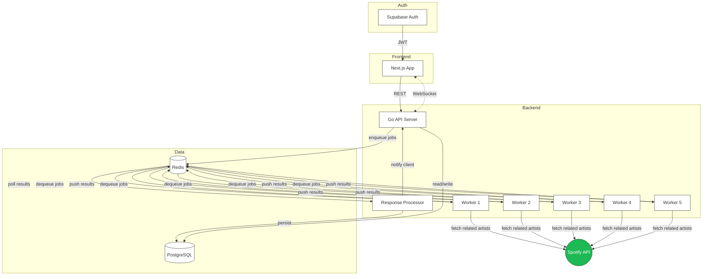
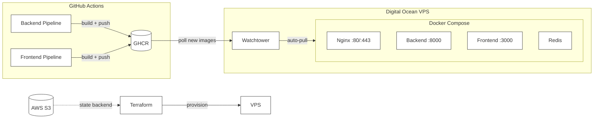

# Shrillecho

Distributed Spotify playlist discovery tool. Input a seed artist, set a crawl depth, and the system traverses Spotify's related artists API using parallel Go workers to build curated artist pools and playlists.

## Tech Stack

| Layer | Technology |
|-------|-----------|
| Frontend | Next.js 14, Tailwind CSS, Zustand, Radix UI |
| Backend | Go 1.23, Chi router, Gorilla WebSocket |
| Database | PostgreSQL (Supabase) |
| Queue/Cache | Redis |
| Auth | Supabase (JWT) |
| Infra | Docker, Terraform, GitHub Actions, Digital Ocean |

## Architecture



## How It Works

1. User authenticates via Supabase and submits a seed artist with a crawl depth
2. The API server enqueues a scrape job to a Redis request queue
3. Five worker goroutines poll the queue, call Spotify's related artists endpoint, and traverse the artist graph to the specified depth
4. Workers push discovered artists to a Redis response queue
5. A response processor persists results to PostgreSQL and sends a WebSocket notification to the frontend

Playlists can also be used as seeds: the system extracts unique artists from a playlist and triggers scrapes for each.

## Project Structure

```
frontend/
  src/
    app/             # Next.js pages
    components/      # Shared UI components
    features/        # Feature modules (auth, scraping, playlists, discovery)
    services/        # API clients
    store/           # Zustand state (slices per feature)

backend/
  cmd/main.go        # Entry point, starts workers + API
  internal/
    api/             # HTTP handlers, routes, middleware
    domain/          # Domain models
    repository/      # PostgreSQL + Redis data access
    services/        # Business logic (scraper, queue, Spotify wrapper)
    spotify/         # Spotify API client + endpoints
    workers/         # Background job processors
    transport/       # DTOs
  sql/               # Schema + queries (sqlc)
```

## CI/CD



Terraform provisions the VPS, installs Docker, and starts the compose stack. Watchtower polls GHCR and auto-deploys new images on push to main.

## Local Development

```bash
# Frontend
cd frontend && npm install && npm run dev

# Backend
cd backend && go run cmd/main.go
```

Required environment variables: Spotify client credentials, Supabase URL/keys, PostgreSQL connection string, Redis URL, JWT secret.
