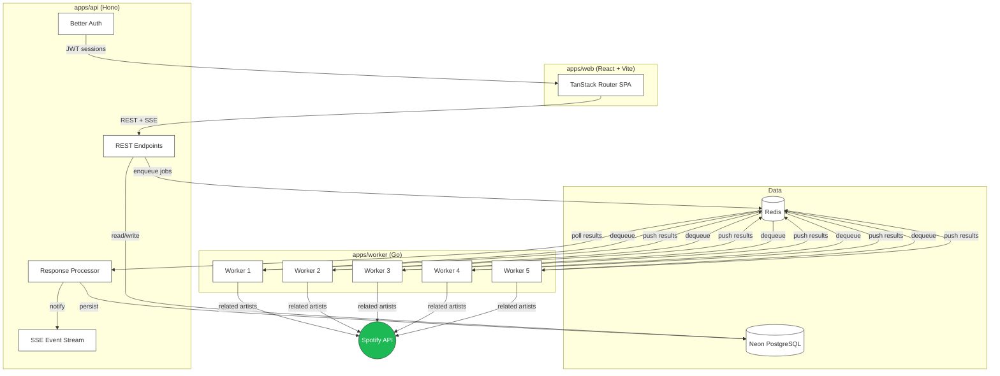

# Shrillecho

Distributed Spotify artist discovery tool. Input a seed artist, set a crawl depth, and the system traverses Spotify's related artists API using parallel Go workers to build curated artist pools.

## Tech Stack

| Layer | Technology |
|-------|-----------|
| Frontend | React 19, Vite, TanStack Router + Query, Tailwind CSS v4, Radix UI |
| API | Hono, Better Auth, Drizzle ORM |
| Database | PostgreSQL (Neon) |
| Queue | Redis (self-hosted) |
| Worker | Go 1.23 |
| Infra | Docker Compose, pnpm workspaces, Turborepo |

## Architecture



## How It Works

1. User signs up via Better Auth (email/password) and submits a seed artist with a crawl depth
2. The Hono API enqueues a scrape job to a Redis request queue
3. Five Go worker goroutines poll the queue, call Spotify's related artists endpoint, and traverse the artist graph to the specified depth
4. Workers push discovered artists to a Redis response queue
5. The API's response processor persists results to PostgreSQL (Neon) and pushes an SSE event to the frontend

## Project Structure

```
shrillecho/
  apps/
    api/                 # Hono API server
      src/
        app.ts           # Main Hono app, route mounting
        auth.ts          # Better Auth config (Drizzle adapter)
        config.ts        # Zod-validated env vars
        db/              # Drizzle schema + queries
        middleware/       # requireAuth middleware
        routes/          # auth, scrapes, users, SSE events
        services/        # Redis queue, scrape logic, response processor
      drizzle.config.ts

    web/                 # React SPA
      src/
        main.tsx         # React root + TanStack Query/Router
        router.tsx       # Route tree with AuthGuard
        pages/           # auth, dashboard, settings
        modules/
          shared/        # API client (Hono RPC), auth client, hooks
          ui/            # Button, Card, Input, Label (shadcn-style)
      vite.config.ts

    worker/              # Go worker service
      cmd/main.go        # Entry point, 5 worker goroutines
      internal/
        services/        # Artist scraper, Redis queue, Spotify ID parsing
        spotify/         # Spotify API client + endpoints

  server.ts              # Production entry (Hono serves API + SPA)
  docker-compose.yml     # Redis + Worker + App
  Dockerfile             # Multi-stage Node build
  turbo.json             # Turborepo task config
  biome.json             # Linting + formatting
```

## Development

```bash
# Install dependencies
pnpm install

# Start Redis
docker compose up redis -d

# Start Go worker
cd apps/worker && go run cmd/main.go

# Start API + frontend (from root)
pnpm dev
```

The Vite dev server proxies `/api` to the Hono API on port 3001. The frontend runs on port 3000.

## Production

```bash
# Single container (API + SPA)
docker compose up app

# Full stack (Redis + Worker + App)
docker compose up
```

The Hono production server serves the API at `/api` and the built SPA as a static fallback, all from a single container. The Go worker runs as a separate container.

## Environment Variables

```bash
NODE_ENV=development
DATABASE_URL=postgresql://...@neon.tech/dbname?sslmode=require
BETTER_AUTH_SECRET=your-secret-key-at-least-32-chars
APP_URL=http://localhost:3000
REDIS_URL=redis://localhost:6379
SPOTIFY_CLIENT_ID=...
SPOTIFY_CLIENT_SECRET=...
```
